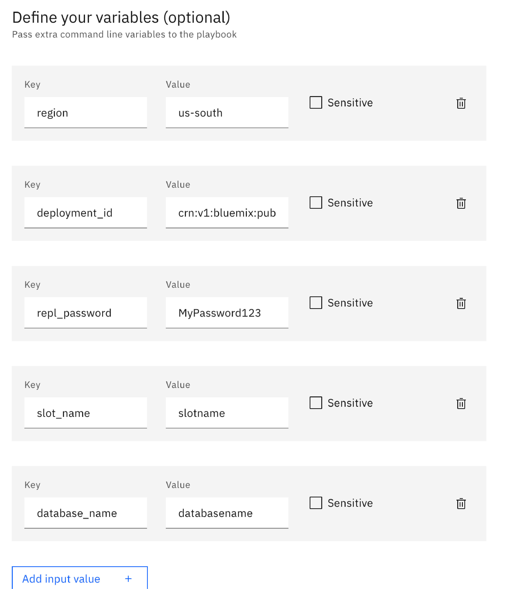

# Configuring WAL2JSON on an IBM Cloud Databases for PostgreSQL instance with Schematics

WAL2JSON is an output plug-in in PostgreSQL that you can use to decode the Write Ahead Log (WAL) in PostgreSQL into a readable JSON format. Other consumers of your database data can use this output to keep track of all data changing transactions in PostgreSQL and the order that they were executed.

This playbook is designed to configure the W2JSON plug-in in an [IBM Cloud Databases for PostgreSQL](https://www.ibm.com/cloud/learn/postgresql) instance by using the built-in Ansible capabilities in Schematics.

IBM Cloud Schematics provides powerful tools to automate your cloud infrastructure provisioning and management process, the configuration and operation of your cloud resources, and the deployment of your app workloads.  To do so, Schematics leverages open source projects, such as Terraform, Ansible, OpenShift, Operators, and Helm, and delivers these capabilities to you as a managed service. Rather than installing each open source project on your machine, and learning the API or CLI, you declare the tasks that you want to run in IBM Cloud and watch Schematics run these tasks for you. For more information about Schematics, see [About IBM Cloud Schematics](https://cloud.ibm.com/docs/schematics?topic=schematics-about-schematics).

## About this playbook

The WAL2JSON plug-in is already installed when you create an IBM Cloud Databases for PostgreSQL instance. However, the plug-in is not yet configured. You can use this playbook to configure the plug-in so that consumers of your database data can start reading the WAL transaction log.

## Prerequisites

To run this playbook, complete the following tasks:
- Make sure that you have the required permissions to [create an IBM Cloud Schematics action](https://cloud.ibm.com/docs/schematics?topic=schematics-access).
- Make sure that you have the required permissions to [create an IBM Cloud Databases for PostgreSQL instance](https://cloud.ibm.com/docs/databases-for-postgresql?topic=cloud-databases-iam).
- [Create an IBM Cloud Databases for PostgreSQL instance](https://cloud.ibm.com/docs/databases-for-postgresql?topic=cloud-databases-provisioning).

## Input variables

You must retrieve the following values to run the playbook in IBM Cloud Schematics.

|Input variable|Required/ optional|Data type|Description|
|--|--|--|--|
|`region`|Required|String|The name of the region where you created your IBM Cloud Databases for PostgreSQL instance, such as `eu-gb`. You can retrieve this value by running the `ibmcloud resource service-instances` command. To install the IBM Cloud CLI, see [Installing the stand-alone IBM Cloud CLI](https://cloud.ibm.com/docs/cli?topic=cli-install-ibmcloud-cli). |
|`deployment_id`|Required|String|The ID of your IBM Cloud Databases for PostgreSQL instance. You can retrieve this value by running the `ibmcloud resource service-instance <service-instance-name>` command.  |
|`repl_password`|Required|String|The password of the replication user that you want to use. The replication user has `Replication` privileges and is set up when you configure the WAS2JSON plug-in.|
|`slot_name`|Required|String|The replication slot name.|
|`database_name`|Required|String|The name of the database for which you want to configure the WAL2JSON plug-in. Every IBM Cloud Databases for PostgreSQL instance is set up with an `ibmclouddb` database by default that you can use. To connect to your IBM Cloud Databases for PostgreSQL instance and create more databases, follow the steps in the [Getting started tutorial](https://cloud.ibm.com/docs/databases-for-postgresql?topic=databases-for-postgresql-getting-started).|

## Running the playbook in Schematics by using UI

1. Open the [Schematics action configuration page](https://cloud.ibm.com/schematics/actions/create?name=postgres&url=https://github.com/Cloud-Schematics/ansible-icd-postgres-actions).
2. Review the name for your action, and the resource group and region where you want to create the action. Then, click **Create**.
3. Select the `wal2json.yml` playbook.
4. Select the **Verbosity** level to control the depth of information that will be shown when you run the playbook in Schematics.
5. Expand the **Advanced options**.
6. Enter all required input variables as key-value pairs. Then, click **Save**.

   
   
7. Click **Check action** to verify your action details. The **Jobs** page opens automatically. You can view the results of this check by looking at the logs.
8. Click **Run action** to configure the WAL2JSON plug-in for the specified database in your IBM Cloud Databases for PostgreSQL instance. You can monitor the progress of this action by reviewing the logs on the **Jobs** page.

   

## Running the playbook in Schematics by using the command line

1. Create the Schematics action. Enter all the input variable values that you retrieved earlier. When you run this command and are prompted to enter a GitHub token, enter the return key to skip this prompt.
   ```
   ibmcloud schematics action create --name wal2json --location us-south --resource-group default --template https://github.com/Cloud-Schematics/ansible-icd-postgres-actions --playbook-name wal2json.yml --input "region": "<postgresql_instance_region>" --input "deployment_id": "<postgresql_instance_ID>" --input "repl_password": "<replication_user_password>" --input "slot_name": "<postgresql_replication_slot_name>" --input "database_name": "<postgresql_database_name>"
   ```

   Example output:
   ```
   Enter github-token>
   The given --inputs option region: is not correctly specified. Must be a variable name and value separated by an equals sign, like --inputs key=value.

   ID               us-south.ACTION.was4postgres.1aa11a1a
   Name             was4postgres
   Description
   Resource Group   default
   user State       live

   OK
   ```

2. Verify that your Schematics action is created and note the ID that was assigned to your action.
   ```
   ibmcloud schematics action list
   ```

3. Create a job to run a check for your action. Replace `<action_ID>` with the action ID that you retrieved. In your CLI output, note the **ID** that was assigned to your job.
   ```
   ibmcloud schematics job run --command-object action --command-object-id <action_ID> --command-name ansible_playbook_check
   ```

   Example output:
   ```
   ID                  us-south.JOB.was4postgres.fedd2fab
   Command Object      action
   Command Object ID   us-south.ACTION.was4postgres.1aa11a1a
   Command Name        ansible_playbook_check
   Name                JOB.was4postgres.ansible_playbook_check.2
   Resource Group      a1a12aaad12b123bbd1d12ab1a123ca1
   ```

4. Verify that your job ran successfully by retrieving the logs.
   ```
   ibmcloud schematics job logs --id <job_ID>
   ```

5. Create another job to run the action. Replace `<action_ID>` with your action ID.
   ```
   ibmcloud schematics job run --command-object action --command-object-id <action_ID> --command-name ansible_playbook_run
   ```

6. Verify that your job ran successfully by retrieving the logs.
   ```
   ibmcloud schematics job logs --id <job_ID>
   ```

## Verification

To verify that the configuration of your plug-in was successful, you must connect to the database for which you enabled the WAL2JSON plug-in.

Before you begin:
- Follow the [Getting started tutorial](https://cloud.ibm.com/docs/databases-for-postgresql?topic=databases-for-postgresql-getting-started) to connect to your database by using pgAdmin or the `psql` CLI.
- [Install the `psql` CLI](https://cloud.ibm.com/docs/databases-for-postgresql?topic=databases-for-postgresql-connecting-psql#installing-psql-). The CLI is required to open the replication stream to the database for which you configured the WAL2JSON plug-in.

**To test the WAL2JSON plug-in**:

1. Open the replication stream for your database. Replace `<database_name>` with the name of the database for which you configured the WAL2JSON plug-in, and `<slot_name>` with the name of the replication slot that you chose when you created the Schematics action. The `<postgresql_hostname>` and `<postgresql_port>` are retrieved when you connect to your PostgreSQL database with pgAdmin or `psql`. When you run this command, you are prompted for the `repl` user password. Use the password that you set when you created the Schematics action.
   ```
   PGSSLMODE=require pg_recvlogical -d <database_name> -U repl -h <postgresql_hostname> -p <postgresql_port> --slot <slot_name> --start -o pretty-print=1 -f -
   ```
2. Create a table in your database and insert sample data. For more information, see the [pdAdmin documentation](https://www.pgadmin.org/docs/pgadmin4/development/modifying_tables.html).

3. Monitor the changes that are reported in your replication stream. As soon as you insert data into your table, this data is sent to the WAL and posted in your replication stream. Note that Data Definition Language changes, such as creating a table or adding columns to a table, are not replicated to the replication stream.

   Example output:
   ```
   {
	"change": [
		{
			"kind": "insert",
			"schema": "public",
			"table": "mytable",
			"columnnames": ["number"],
			"columntypes": ["integer"],
			"columnvalues": [2]
		}
	   ]
   }
   ```

   You can now configure consumers of your database to connect to this replication stream and keep track of data transactions in your database. For more information, see the [PostgreSQL documentation](https://www.postgresql.org/docs/8.0/wal.html).

## Delete an action

1. From the [Schematics actions dashboard](https://cloud.ibm.com/schematics/actions){: external}, find the action that you want to delete.
2. From the actions menu, click **Delete**.

## Reference

Review the following links to find more information about Schematics and IBM Cloud Databases for PostgreSQL

- [IBM Cloud Schematics documentation](https://cloud.ibm.com/docs/schematics)
- [PostgreSQL documentation](https://www.postgresql.org/docs/8.0/wal.html)
- [pgAdmin documentation](https://www.pgadmin.org/docs/)

## Getting help

For help and support with using this template in IBM Cloud Schematics, see [Getting help and support](https://cloud.ibm.com/docs/schematics?topic=schematics-schematics-help).

